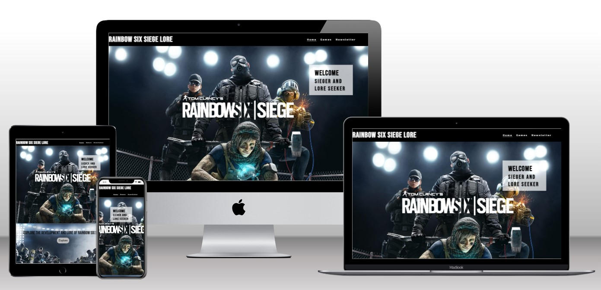
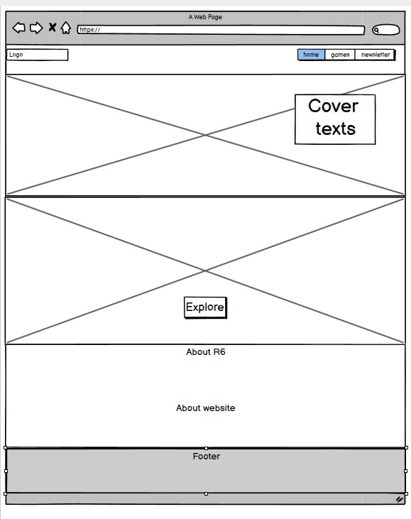
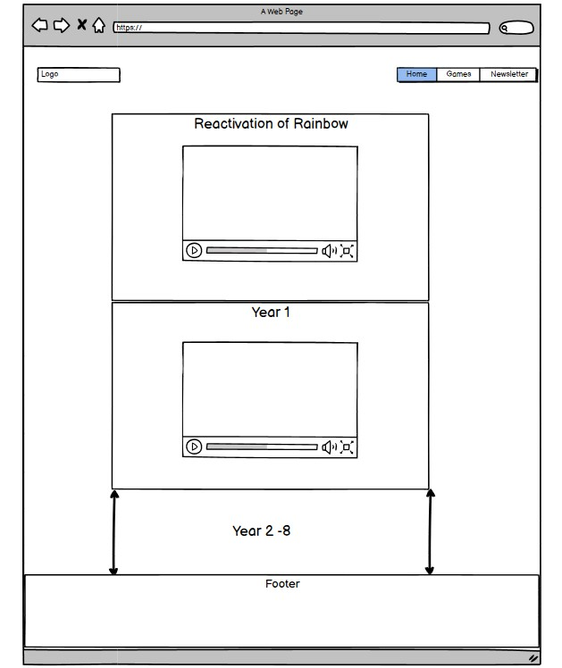
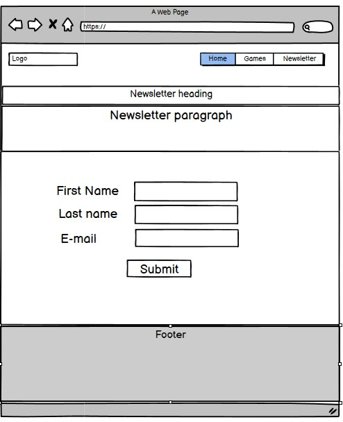
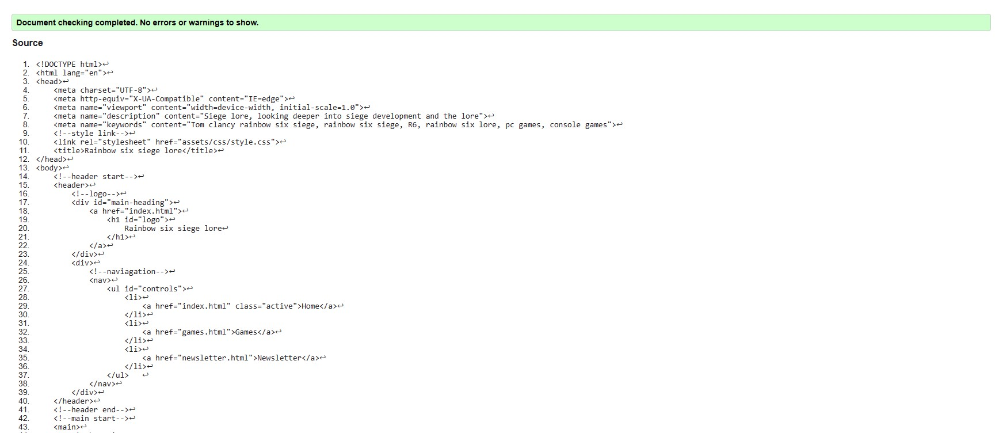
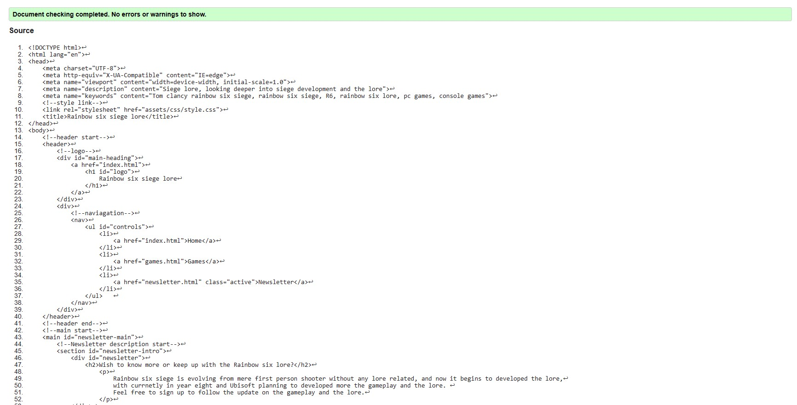
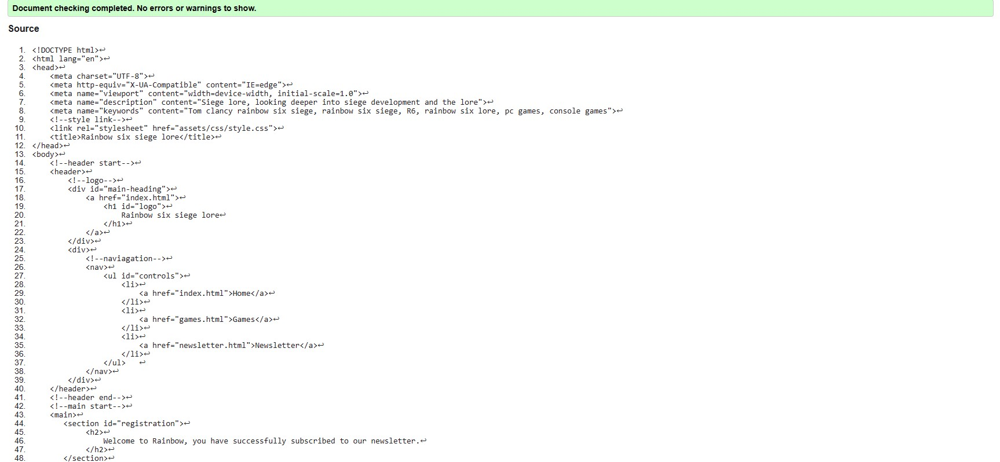
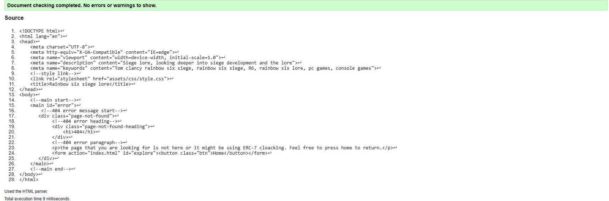
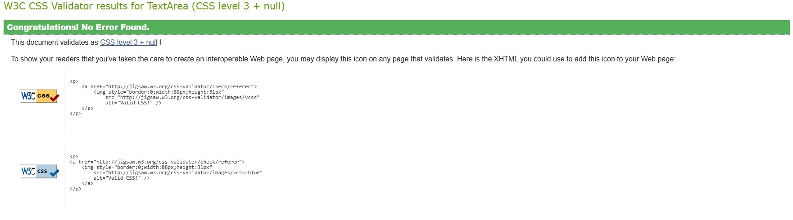

# Rainbow six siege lore

This website is for entertainment and educational purpose, starting by looking back into where Rainbow six siege first released, the development, and in-depth into the lore. By using different type of media such as image and video to entertain and educate the user about the game history, and future of development. By utilizing newsletter the user will be getting an update on the lore and the development of the game.

[Link to deployed site](https://timothyyw.github.io/Rainbow-six-siege-lore/)

# Feature

## Navigation Bar (Index/Homepage)
Within homepage, featured three navigation bar and logo full responsive ,and It is identical with other page to ensure easy navigation for the user.
    
Index html screenshot

## Hero Image First

Once load the user will be greeted with welcome message and one of the background showing some of the operators of rainbow six siege, this hero image was one of the games background picture from the past version of the games,and with this image hopefully may giving the user who played the game before the feeling of nostalgia. 

Hero image first

##  Hero Image Second

Below the first hero image will be waiting for the user a shortcut button to go to the games section to learn of the lore of rainbow six siege with background picture, showing rainbow operators going toe to toe to hype up the user to learn about rainbow.

Hero image second

## About 

about section will be explaining what is rainbow six siege including a quick link again, in case if the user want to learn about the game first before going to the lore of the game, while below will be explaining the purpose of the website.

About section 

## Footer

A quick link for the social medias to allow the user to access the social medias, and it will open a new tab instead of taking away the page.

footer picture

## Games

Within the games section will be showing the lore starting from the reactivation of rainbow to the current seasons. With the Youtube link will be showing the highlight of the seaoson and what is the current stand within the lore. User able to click the video to play the video and it will not play automaticly when opening the page.

games 

## Newsletter

The newsletter allowing the user to sign-up to get an update of the games lore and the feature, with message encouraging that siege continue developing and keep up with the games development. The user required to provide their first and last name with an Email, afterwards there will be message confirmation that their information has been recorded.

Newletter

## 404 

The creation of 404 error page is to direct the user to that page in case the page that user looking for is not available, with some added joke for rainbow six siege player. Styling of the page is simplfied to ensure no confusion and for a shortcut to return to homepage.

404 error 

# UX

The purpose of this site is to entertain and educate the user with Rainbow six siege development and lore, this include trailers from the previous update and the comics from the game developer Ubisoft. By utilizing Youtube video embedded on each years and seasons, it will provide the user with entertainment and help the user to understand the lore and the developement.

The font I used were Bebas neue for the logo and heading, since I find it close resemblance to the original logo of rainbow six siege. As can be seen below:

While for the font style for the paragraph using Exo 2 which is simple, but similar to the theme of rainbow six siege and easy to read. Combining with white color, allowing words to appear simple and keep-up with theme.

The color scheme will be using black and white to simplfy and stick with old classic Rainbow six siege color. The header will be using the color black and white to make it easier to navigate, while the main section will be using both background pictures and the grey color to keep up with theme. The use of background images as for decoration and to give the looks of the member of rainbow six siege.

The wireframes for the home, games, and newletter can be view below:

The sketches are used to ensure the structure of the website, but as can be seen that games page has been simplfied to fitting all the image in the readme.md. 

## Testing

Testing of the HTML using W3C validator and CSS using Jigsaw, the results can be seen below:

Index:

Games:

Newletter:

Registration:

404:

CSS:

## Technologies utilized

HTML

CSS

Google Fonts

Github

Google Chrome Lighthouse

Balsemig

W3C

Jigsaw

Wave

## Bugs

During coding for games.html when creating the timelines, I put too many content within which causing it to be lagging, in order to fixed it, I moved all the content into eight seperate html.

## Credits

Hero image:

https://coolthemestores.com/rainbow-six-siege-wallpaper-hd-new-tab/

Hero image second and background games:

https://wall.alphacoders.com/by_sub_category.php?id=225751&name=Tom+Clancy%27s+Rainbow+Six%3A+Siege+Wallpapers

 All games timelines information gather from source below:

 https://rainbowsix.fandom.com/wiki/Tom_Clancy%27s_Rainbow_Six_Siege

 https://www.youtube.com/watch?v=KYV8lYwteEU&t=286s

### Year 1

Season 1

https://www.youtube.com/watch?v=h_rf8K13gow

Season 2

https://youtu.be/cqHxebcvgDE

Season 3

https://youtu.be/lqsL4QpKXeM

Season 4

https://youtu.be/12hNVzz4CYY

### Year 2

Season 1

https://youtu.be/TuNPJIVR9AM

Season 2

https://youtu.be/rhJscsn4GWs

Season 3

https://youtu.be/93jV9004foc

Season 4

https://youtu.be/Ld1LL97Pry0

### Year 3

Season 1

https://youtu.be/meLOY29qarc

https://youtu.be/LAGk9wEvf9c

Season 2

https://youtu.be/FAtll3RFHSw

Season 3

https://youtu.be/PYGbFvSfgmY

Season 4

https://youtu.be/jPZbHhfvjzg

### Year 4

Hammer & Scalpel

https://youtu.be/C61bhu8eI3o

The program

https://youtu.be/JvxnlR1BaEU

Season 1

https://youtu.be/Nymp-HB4kgU

Season 2

https://youtu.be/nRuFq-pN9QU

Season 3

https://youtu.be/U4pe1Ei7Pk4

Season 4

https://youtu.be/wRFQuon0Veg

https://youtu.be/swl0anQp4eI

### Year 5

Tournament of champion

https://youtu.be/RDz1dUceFAQ

Season 1

https://youtu.be/_C0jv_cXrj8

Season 2

https://youtu.be/c41qhi9Pi5A

Season 3

https://youtu.be/ZFRsW_cMLAk

Season 4

https://youtu.be/ug5lI1VjiRg

### Year 6

The playbook

https://youtu.be/hd0sbs5Pu28?si=95CixNfwALTSfjI4

Season 1

https://youtu.be/b2LV-T3PROE?si=9Xa4a-GZg5zTJKH5

Season 2

https://youtu.be/njfw9e26PQA?si=3-rZ7Cy0rYAAdqvf

Season 3

https://youtu.be/3jwF1WqxHzY?si=xPX4qeNz9HNAGz1O

Season 4

https://youtu.be/-s1SsNSHKlc?si=PJ7Z38NeCG8_jDTX

### Year 7

Sister in arms

https://youtu.be/1-utBXsiOG0?si=Mcz9H3PzI_TM8q6F

Night haven situation

https://youtu.be/VYV1l7Zcz94?si=faSIYOkGd1eXTlkI

Season 1

https://youtu.be/GMo1565ijf4?si=hXqdCBteGr9Lg_lB

Season 2

https://youtu.be/n3mmX0J05vc?si=1J5wlCuKedDuklDd

Season 3

https://youtu.be/FB5h_3yHtu8?si=TKUMhGHYz31zMQCD

Season 4

https://youtu.be/cce6Wn2SQo0?si=2IH3AkCS-8gxRkPF

### Year 8

Siege Invitational 2023

https://youtu.be/jQeh4BJxfMg?si=hBjXak7N5e-lhj_D

Season 1

https://youtu.be/g7Jc9yxr5Lk?si=bd6dgziF0u-B3oiT

Season 2

https://youtu.be/Unj2rUT_abw?si=wSDl9TiaRjlIOB0G

### Comic link

https://www.ubisoft.com/en-us/game/rainbow-six/siege/game-info/media

### Favicon

https://icons8.com/icon/iExfEgcZKka2/rainbow-six-siege

## Achknowledge

This website has taken inspiration from Love Running project.

### Timelines creation tutorial

https://youtu.be/zNccqv0g6Q4?si=3T6TJ38ymCBqBgD

### How to create 404 error page

https://www.youtube.com/watch?v=vQsir0JIjPY

### How to speed up video load up

https://stackoverflow.com/questions/1268482/is-there-a-way-to-load-embedded-youtube-videos-faster-on-my-website

### How to add favicon

https://www.w3schools.com/html/html_favicon.asp