# Rainbow Six Siege Lore

This website is for entertainment and educational purposes, starting by looking back at where Rainbow Six Siege was first released, its development, and an in-depth look into the lore. By using different types of media such as images and video to entertain and educate the user about the game's history and future development. By utilizing the newsletter, the user will receive updates on the lore and the development of the game.

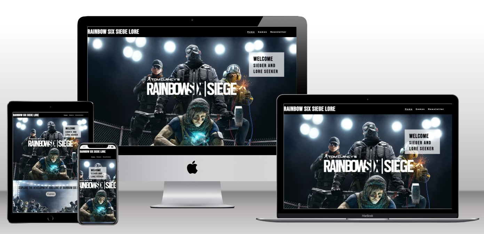

[Link to deployed site](https://timothyyw.github.io/Rainbow-six-siege-lore/)

# Feature

## Navigation Bar (Index/Homepage)
Within the homepage, are featured three navigation bars and a fully responsive logo, and it is identical with other pages to ensure easy navigation for the user.
    
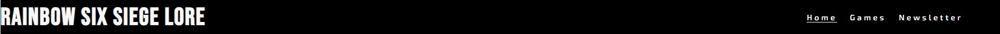

## Hero Image First

Once loaded, the user will be greeted with a welcome message and a background showing some of the operators of Rainbow Six Siege. This hero image was one of the game's background pictures from a past version of the game, and will hopefully give the user a feeling of nostalgia.

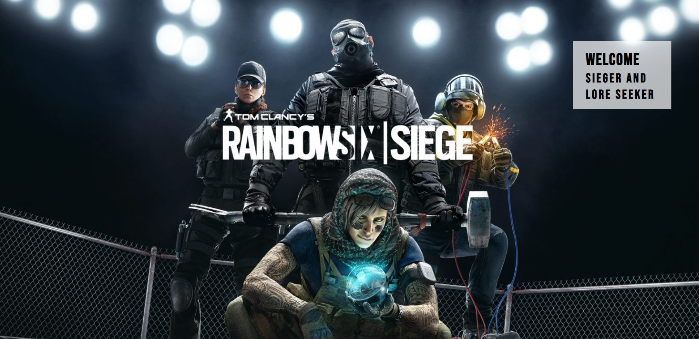

##  Hero Image Second

Below the first hero image, there is a second hero image with a shortcut button to go to the games section to learn about the lore of Rainbow Six Siege. This hero image shows rainbow operators going head-to-head to hype up the user to learn about rainbow.

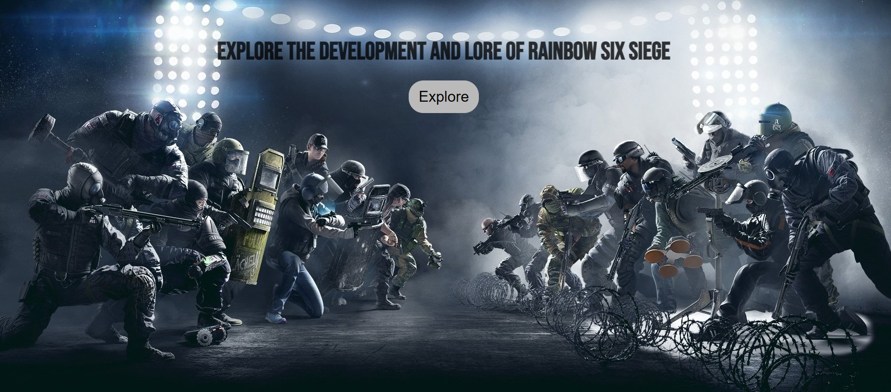

## About 

The about section explains what is rainbow six siege including a quick link again, in case the user wants to learn about the game first before going to the lore of the game. The purpose of the websites is explained below.

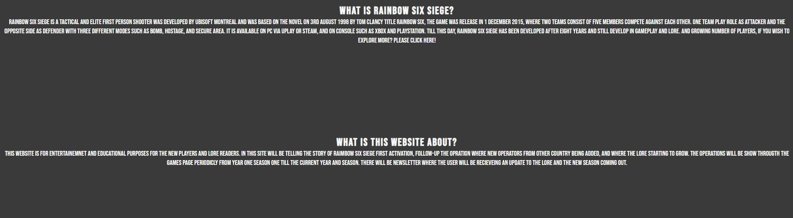 

## Footer

A quick link for the user to access social media, it will open new tab instead of taking away the page.

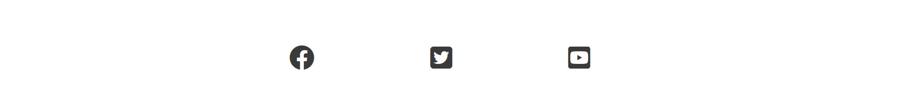

## Games

The games section shows everything starting from the reactivation of rainbow through to the current seasons. The embedded YouTube videos highlight each season and the current state of the lore. Users are able to click the video to play it and it will not play automatically when opening the page.

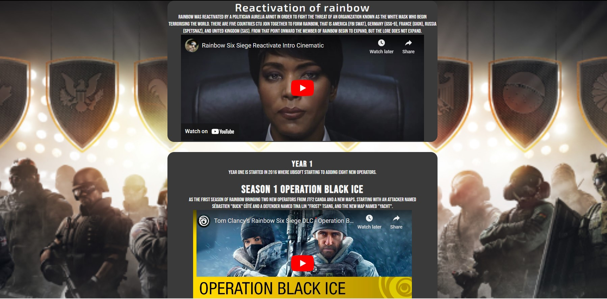

## Newsletter

The newsletter allows the user to sign up to receive updates on the game's lore and features, with an encouraging message to keep up with the game's development. The user is required to provide their first and last name along with an email address, after which a confirmation message will appear to confirm their subscription.

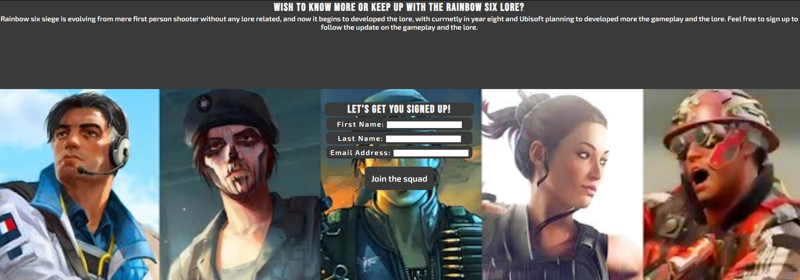

## 404 

The 404 error page is shown when the user navigates to a page that is not available, with an added joke for Rainbow Six Siege players. The styling of the page is simplified to avoid confusion and includes a shortcut to return to the homepage.

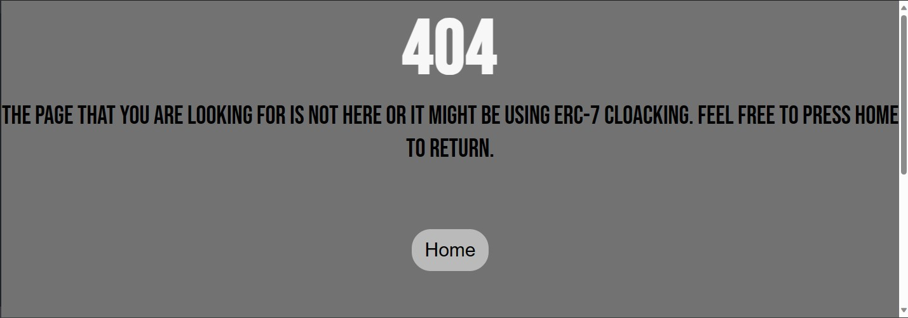

# UX

The purpose of this site is to entertain and educate the user about Rainbow Six Siege's development and lore, including trailers from previous updates and comics from the game developer Ubisoft. By utilizing YouTube videos embedded for each year and season, it provides the user with entertainment and helps them understand the lore and the development.

The font used is Bebas Neue for the logo and headings, since it closely resembles the original logo of Rainbow Six Siege. As can be seen below:

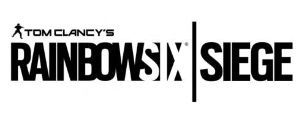

For paragraph text, Exo 2 is used, as it is similar to the theme of Rainbow Six Siege and easy to read. Combined with white text on dark backgrounds, it keeps the words legible while staying true to the theme.

The color scheme uses black and white to keep things simple and in line with the classic Rainbow Six Siege aesthetic. The header uses black and white to make navigation easier, while the main section uses both background images and grey tones to stay on theme. The background images serve as decoration and evoke the look and feel of Rainbow Six Siege.

The wireframes for the home, games, and newsletter can be viewed below:

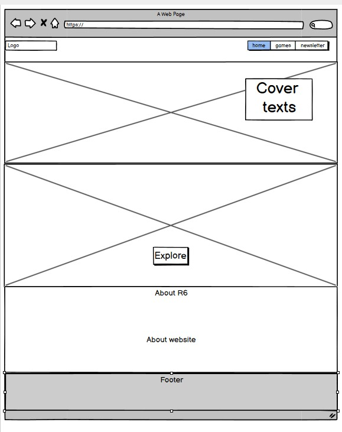

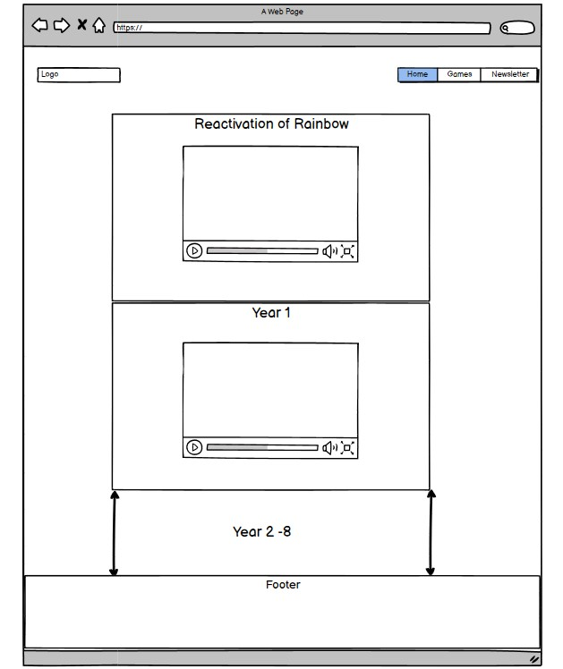

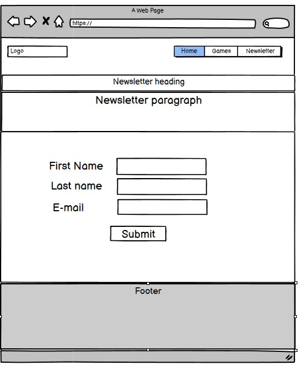

The sketches are used to plan the structure of the website, but as can be seen the games page has been simplified to fit all the images in the README.md.

# Future update and plan

Update will be continue as year progresses.

Creating a page that is dedicated operators biography.

Adding a drop-down menu for the games page.

# Testing

Testing of the HTML using W3C validator and CSS using Jigsaw, the results can be seen below:

Index:

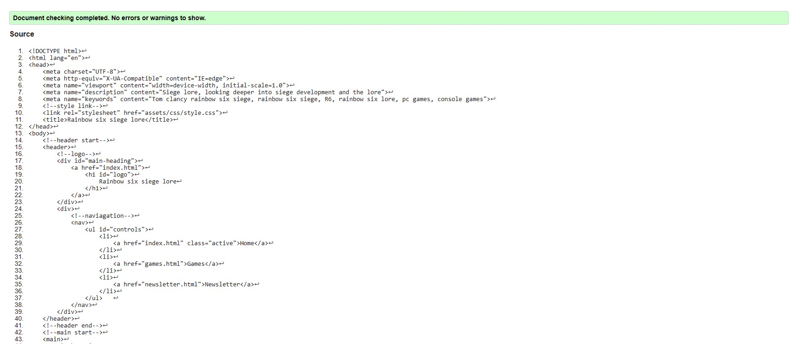

Games:

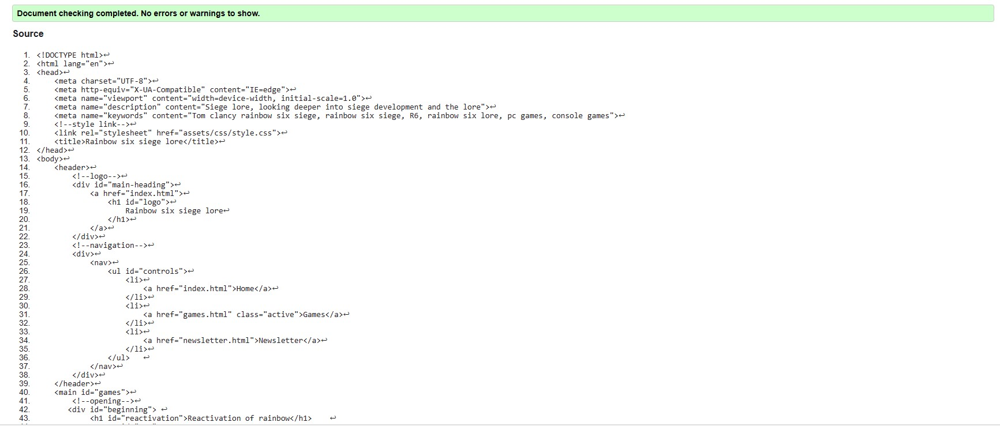

Newsletter:

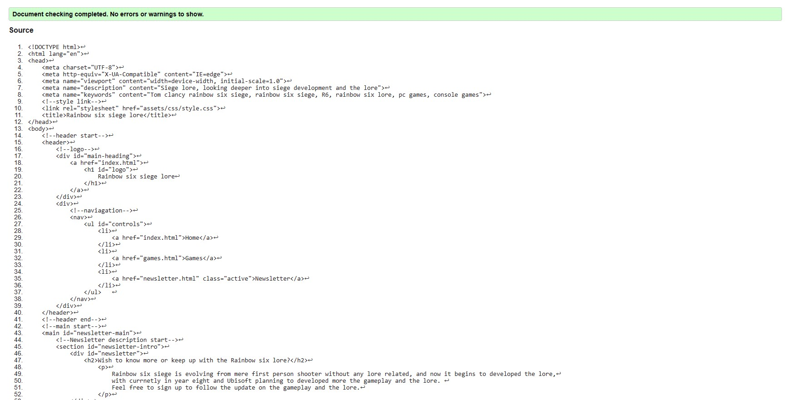

Registration:

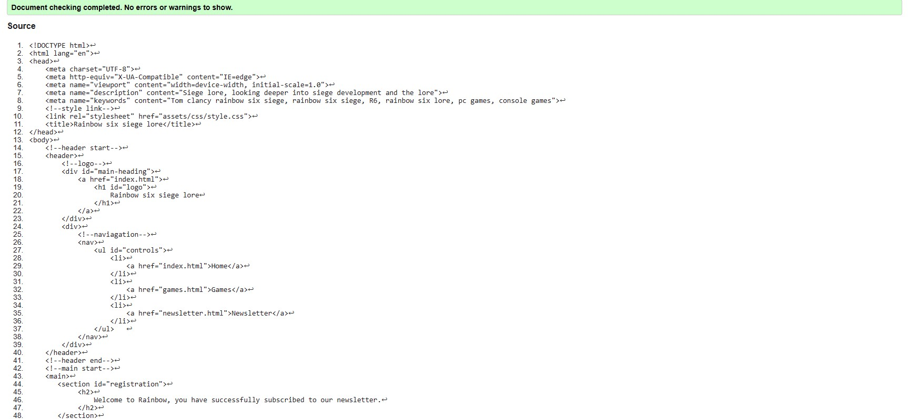

404:

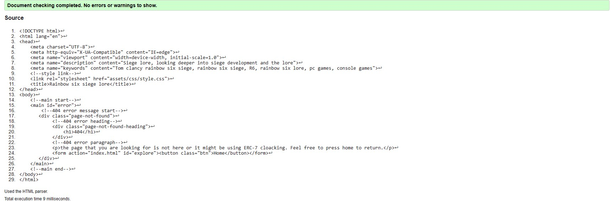

CSS:

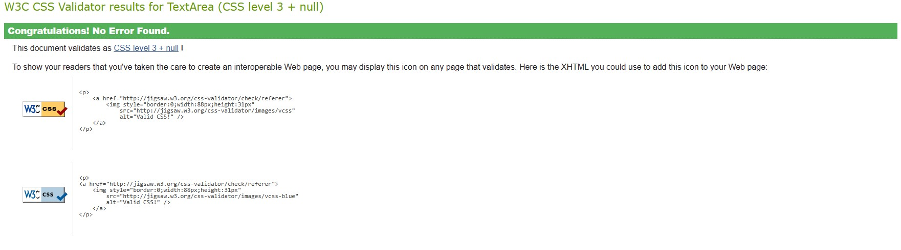

### Lighthouse devtool:

The Lighthouse devtool measures the website's level of performance, accessibility, best practices, and SEO. The scores can be seen below:

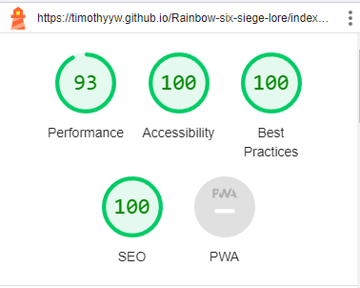

### Wave

The Wave evaluation tool is used to check for color contrast issues, as can be seen in the result below:

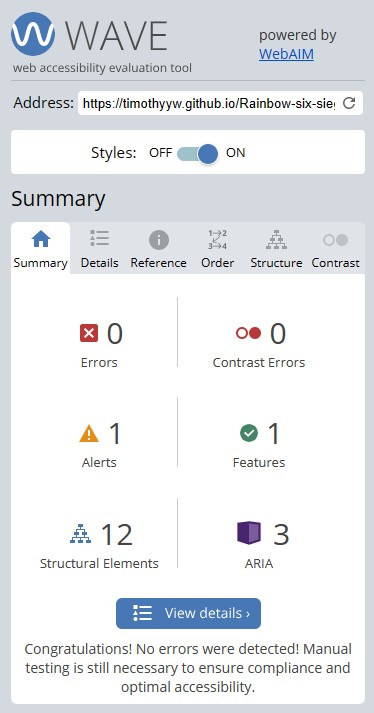

### Other testing

**Step (Method)**|**Expected**|**Results**
:-----:|:-----:|:-----:
Using devtools and shrink and extend site|Site responsive to all type of device|Success
On games page the video does not play and only play when click|Youtube does not play automaticly|Success
Manually click on buttons and logo within the website|All navigation menus direct user to its destination|Success
Use personal email to see if the correct message displayed|message appear in the screen to confirm subscription|Success
Manually click on the links|all links went to the correct social media|Success
**Create link from github and use it**|**the home page appeared first**|**success**

# Technologies utilized

HTML is used to write the code and build the website.

CSS is used to style the code.

Google Fonts is providing the style for the letter that is written and displayed on the website.

Github is where the code will be stored.

Google Chrome Lighthouse is used to check the website performance and accessibility.

Balsamiq is used to create the wireframe sketches for the website structure.

W3C used to validate and ensure there are no errors in the HTML code.

Jigsaw is to ensure that there are no error on the CSS code.

Wave is to check if there is color contrast.

# Bugs

During coding for games.html, when creating the timelines, too much content was placed on one page which caused lag. To fix it, the content was moved into eight separate HTML files. In the end, it was discovered that the reason for the lag was the quality and size of the background image, so the background image size was reduced and all the games content was put back on a single page.

# Deployment

To deploy the project please follow step below:
    
    1. Log in to Github.
    2. Go to setting right next to Insight.
    3. Within setting navigate to Pages below Codespaces.
    4. Under the Branch, change from "none" to "main".
    5. Click "Save".
    6. Wait for few minute.
    7. A link will be provided.

## Version Control

To use version control utilizing the git command:

    1. Git add . will create a file with the new code that has been added
    2. Git commit is to commit the changes
    3. Git push is to add the version of the file in to the repository

After creating new version of the file it will be commited, which means it can be viewed and compared previous and newer version.

## Cloning Repository 

For cloning repository, can be done as followed:

    1. Open github repository
    2. Above file open drop down menu code copy URL, there are three version HTTP, SSH, and GitCLI, all version work on cloning.
    3. Open Git Bash.
    4. Type Git clone URL

# Credits

Hero image:

https://coolthemestores.com/rainbow-six-siege-wallpaper-hd-new-tab/

Hero image second and background games:

https://wall.alphacoders.com/by_sub_category.php?id=225751&name=Tom+Clancy%27s+Rainbow+Six%3A+Siege+Wallpapers

 All games timelines information gather from source below:

 https://rainbowsix.fandom.com/wiki/Tom_Clancy%27s_Rainbow_Six_Siege

 https://www.youtube.com/watch?v=KYV8lYwteEU&t=286s

### Year 1

Season 1

https://www.youtube.com/watch?v=h_rf8K13gow

Season 2

https://youtu.be/cqHxebcvgDE

Season 3

https://youtu.be/lqsL4QpKXeM

Season 4

https://youtu.be/12hNVzz4CYY

### Year 2

Season 1

https://youtu.be/TuNPJIVR9AM

Season 2

https://youtu.be/rhJscsn4GWs

Season 3

https://youtu.be/93jV9004foc

Season 4

https://youtu.be/Ld1LL97Pry0

### Year 3

Season 1

https://youtu.be/meLOY29qarc

https://youtu.be/LAGk9wEvf9c

Season 2

https://youtu.be/FAtll3RFHSw

Season 3

https://youtu.be/PYGbFvSfgmY

Season 4

https://youtu.be/jPZbHhfvjzg

### Year 4

Hammer & Scalpel

https://youtu.be/C61bhu8eI3o

The program

https://youtu.be/JvxnlR1BaEU

Season 1

https://youtu.be/Nymp-HB4kgU

Season 2

https://youtu.be/nRuFq-pN9QU

Season 3

https://youtu.be/U4pe1Ei7Pk4

Season 4

https://youtu.be/wRFQuon0Veg

https://youtu.be/swl0anQp4eI

### Year 5

Tournament of champion

https://youtu.be/RDz1dUceFAQ

Season 1

https://youtu.be/_C0jv_cXrj8

Season 2

https://youtu.be/c41qhi9Pi5A

Season 3

https://youtu.be/ZFRsW_cMLAk

Season 4

https://youtu.be/ug5lI1VjiRg

### Year 6

The playbook

https://youtu.be/hd0sbs5Pu28?si=95CixNfwALTSfjI4

Season 1

https://youtu.be/b2LV-T3PROE?si=9Xa4a-GZg5zTJKH5

Season 2

https://youtu.be/njfw9e26PQA?si=3-rZ7Cy0rYAAdqvf

Season 3

https://youtu.be/3jwF1WqxHzY?si=xPX4qeNz9HNAGz1O

Season 4

https://youtu.be/-s1SsNSHKlc?si=PJ7Z38NeCG8_jDTX

### Year 7

Sister in arms

https://youtu.be/1-utBXsiOG0?si=Mcz9H3PzI_TM8q6F

Night haven situation

https://youtu.be/VYV1l7Zcz94?si=faSIYOkGd1eXTlkI

Season 1

https://youtu.be/GMo1565ijf4?si=hXqdCBteGr9Lg_lB

Season 2

https://youtu.be/n3mmX0J05vc?si=1J5wlCuKedDuklDd

Season 3

https://youtu.be/FB5h_3yHtu8?si=TKUMhGHYz31zMQCD

Season 4

https://youtu.be/cce6Wn2SQo0?si=2IH3AkCS-8gxRkPF

### Year 8

Siege Invitational 2023

https://youtu.be/jQeh4BJxfMg?si=hBjXak7N5e-lhj_D

Season 1

https://youtu.be/g7Jc9yxr5Lk?si=bd6dgziF0u-B3oiT

Season 2

https://youtu.be/Unj2rUT_abw?si=wSDl9TiaRjlIOB0G

### Comic link

https://www.ubisoft.com/en-us/game/rainbow-six/siege/game-info/media

### Favicon

https://icons8.com/icon/iExfEgcZKka2/rainbow-six-siege

# Acknowledgements

This website has taken inspiration from Love Running project.

Thank you to my mentor Daisy McGirr for her guidance.

### Timelines creation tutorial

https://youtu.be/zNccqv0g6Q4?si=3T6TJ38ymCBqBgD

### How to create 404 error page

https://www.youtube.com/watch?v=vQsir0JIjPY

### How to speed up video load up

https://stackoverflow.com/questions/1268482/is-there-a-way-to-load-embedded-youtube-videos-faster-on-my-website

### How to add favicon

https://www.w3schools.com/html/html_favicon.asp

### What is version control

https://ourcodingclub.github.io/tutorials/git/

### Cloning repository

https://docs.github.com/en/repositories/creating-and-managing-repositories/cloning-a-repository