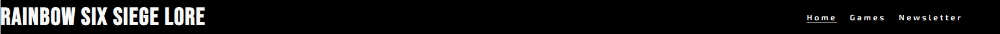
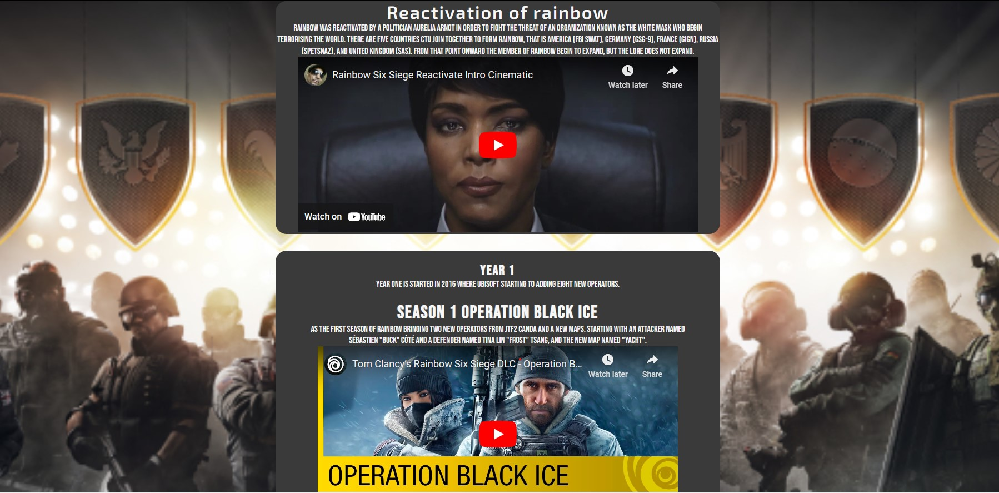
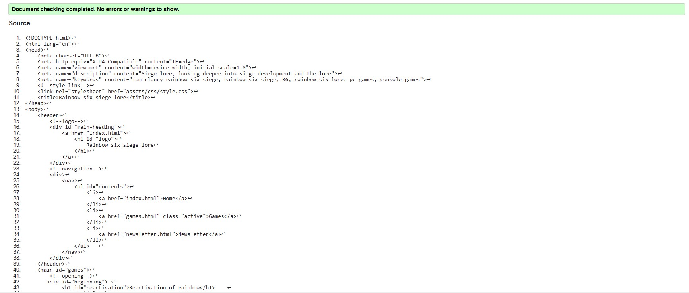

# Rainbow six siege lore

This website is for entertainment and educational purposes, starting by looking back into where Rainbow six siege was first released, the development, and in-depth into the lore. By using different types of media such as image and video to entertain and educate the user about the game history, and future of development. By utilizing the newsletter the user will be getting an update on the lore and the development of the game.

[Link to deployed site](https://timothyyw.github.io/Rainbow-six-siege-lore/)

# Feature

## Navigation Bar (Index/Homepage)
Within the homepage, are featured three navigation bars and a fully responsive logo, and it is identical with other pages to ensure easy navigation for the user.
    

## Hero Image First

Once loaded the user will be greeted at first with a welcome message and one of the backgrounds showing some of the operators of rainbow six siege. This hero image was one of the games background pictures from the past version of the games,and this image will hopefully give the user a feeling nostalgia.

##  Hero Image Second

Below the first hero image, there is a second hero image with a shortcut button to go to the games section to learn of the lore of rainbow six siege with another background picture, while this hero image showing rainbow operators going toe to toe to hype up the user to learn about rainbow.

## About 

The about section explains what is rainbow six siege including a quick link again, in case the user wants to learn about the game first before going to the lore of the game. The purpose of the websites is explained below.

 

## Footer

A quick link for the user to access social media, it will open new tab instead of taking away the page.

## Games

The games section shows the starting of from the reactivation of rainbow to the current seasons. With the Youtube link will be showing the highlight of the seasons and what is the current stand within the lore. Users are able to click the video to play the video and it will not play automaticly when opening the page.

## Newsletter

The newsletter allows the user to sign-up to get an update of the games lore and the feature, with an ecouranging message to keep-up with the games development. The user is required to provide their first and last name with an Email, afterwards there will be message confirmation that their information has been recorded.

## 404 

The 404 error page is to direct the user to the page that is not available, with some added joke for rainbow six siege player. Styling of the page is simplfied to ensure no confusion and for a shortcut to return to the homepage.

# UX

The purpose of this site is to entertain and to educate the user with Rainbow six siege development and lore, this includes trailers from the previous update and the comics from the game developer Ubisoft. By utilizing Youtube videos embedded on each years and seasons, it will provide the user with entertainment and help the user to understand the lore and the developement.

The font I used is Bebas neue for the logo and heading, since I found it closely resembled the original logo of rainbow six siege. As can be seen below:

For the paragraph font style Exo 2 is used, but it is similarly to the theme of rainbow six siege and easy to read, combining with white color, allowing words to appear simple and keep-up with the theme.

The color scheme will be using black and white to simplfy and stick with old classic Rainbow six siege color. The header will be using the color black and white to make it easier to navigate, while the main section will be using both background pictures and the grey color to keep up with theme. The use of background images as for decoration and to give the looks of the member of rainbow six siege.

The wireframes for the home, games, and newletter can be viewed below:

The sketches are used to ensure the structure of the website, but as can be seen the games page has been simplfied to fi all the images in the read me.md. 

# Future update and plan

Update will be continue as year progresses.

Creating a page that is dedicated operators biography.

Adding a drop-down menu for the games page.

# Testing

Testing of the HTML using W3C validator and CSS using Jigsaw, the results can be seen below:

Index:

Games:

Newletter:

Registration:

404:

CSS:

### Lighthouse devtool:

The lighthouse devtool ensure the website`s level of performance, accessabllity, best practice, and SEO. The score of the website can be seen below:

### Wave

The wave evaluation tool to ensure that there are no color contrasts, as can be seen in the result below:

### Other testing

**Step (Method)**|**Expected**|**Results**
:-----:|:-----:|:-----:
Using devtools and shrink and extend site|Site responsive to all type of device|Success
On games page the video does not play and only play when click|Youtube does not play automaticly|Success
Manually click on buttons and logo within the website|All navigation menus direct user to its destination|Success
Use personal email to see if the correct message displayed|message appear in the screen to confirm subscription|Success
Manually click on the links|all links went to the correct social media|Success
**Create link from github and use it**|**the home page appeared first**|**success**

# Technologies utilized

HTML is used for write the code and to built the website.

CSS is used style the code.

Google Fonts is providing the style for the letter that is written and displayed on the website.

Github is where the code will be stored.

Google Chrome Lighthouse is used to check the website performance and accessibility.

Balsemig is used to make the sketch wireframes for the website strucutres.

W3C used to validated and ensured there are no errors on HTML code.

Jigsaw is to ensure that there are no error on the CSS code.

Wave is to check if there is color contrast.

# Bugs

During coding for games.html when creating the timelines, I put too much content within which caused it to be lag. to fixed it, I moved all the content into eight seperate html. In the end, it is discovered the reason the reason for the lag was the quality of the background image and size of the background image, as a result the background image size has been reduce and all in games content has been put back on the page.

# Deployment

To deploy the project please follow step below:
    
    1. Log in to Github.
    2. Go to setting right next to Insight.
    3. Within setting navigate to Pages below Codespaces.
    4. Under the Branch, change from "none" to "main".
    5. Click "Save".
    6. Wait for few minute.
    7. A link will be provided.

## Version Control

To use version control utilizing the git command:

    1. Git add . will create a file with the new code that has been added
    2. Git commit is to commit the changes
    3. Git push is to add the version of the file in to the repository

After creating new version of the file it will be commited, which means it can be viewed and compared previous and newer version.

## Cloning Repository 

For cloning repository, can be done as followed:

    1. Open github repository
    2. Above file open drop down menu code copy URL, there are three version HTTP, SSH, and GitCLI, all version work on cloning.
    3. Open Git Bash.
    4. Type Git clone URL

# Credits

Hero image:

https://coolthemestores.com/rainbow-six-siege-wallpaper-hd-new-tab/

Hero image second and background games:

https://wall.alphacoders.com/by_sub_category.php?id=225751&name=Tom+Clancy%27s+Rainbow+Six%3A+Siege+Wallpapers

 All games timelines information gather from source below:

 https://rainbowsix.fandom.com/wiki/Tom_Clancy%27s_Rainbow_Six_Siege

 https://www.youtube.com/watch?v=KYV8lYwteEU&t=286s

### Year 1

Season 1

https://www.youtube.com/watch?v=h_rf8K13gow

Season 2

https://youtu.be/cqHxebcvgDE

Season 3

https://youtu.be/lqsL4QpKXeM

Season 4

https://youtu.be/12hNVzz4CYY

### Year 2

Season 1

https://youtu.be/TuNPJIVR9AM

Season 2

https://youtu.be/rhJscsn4GWs

Season 3

https://youtu.be/93jV9004foc

Season 4

https://youtu.be/Ld1LL97Pry0

### Year 3

Season 1

https://youtu.be/meLOY29qarc

https://youtu.be/LAGk9wEvf9c

Season 2

https://youtu.be/FAtll3RFHSw

Season 3

https://youtu.be/PYGbFvSfgmY

Season 4

https://youtu.be/jPZbHhfvjzg

### Year 4

Hammer & Scalpel

https://youtu.be/C61bhu8eI3o

The program

https://youtu.be/JvxnlR1BaEU

Season 1

https://youtu.be/Nymp-HB4kgU

Season 2

https://youtu.be/nRuFq-pN9QU

Season 3

https://youtu.be/U4pe1Ei7Pk4

Season 4

https://youtu.be/wRFQuon0Veg

https://youtu.be/swl0anQp4eI

### Year 5

Tournament of champion

https://youtu.be/RDz1dUceFAQ

Season 1

https://youtu.be/_C0jv_cXrj8

Season 2

https://youtu.be/c41qhi9Pi5A

Season 3

https://youtu.be/ZFRsW_cMLAk

Season 4

https://youtu.be/ug5lI1VjiRg

### Year 6

The playbook

https://youtu.be/hd0sbs5Pu28?si=95CixNfwALTSfjI4

Season 1

https://youtu.be/b2LV-T3PROE?si=9Xa4a-GZg5zTJKH5

Season 2

https://youtu.be/njfw9e26PQA?si=3-rZ7Cy0rYAAdqvf

Season 3

https://youtu.be/3jwF1WqxHzY?si=xPX4qeNz9HNAGz1O

Season 4

https://youtu.be/-s1SsNSHKlc?si=PJ7Z38NeCG8_jDTX

### Year 7

Sister in arms

https://youtu.be/1-utBXsiOG0?si=Mcz9H3PzI_TM8q6F

Night haven situation

https://youtu.be/VYV1l7Zcz94?si=faSIYOkGd1eXTlkI

Season 1

https://youtu.be/GMo1565ijf4?si=hXqdCBteGr9Lg_lB

Season 2

https://youtu.be/n3mmX0J05vc?si=1J5wlCuKedDuklDd

Season 3

https://youtu.be/FB5h_3yHtu8?si=TKUMhGHYz31zMQCD

Season 4

https://youtu.be/cce6Wn2SQo0?si=2IH3AkCS-8gxRkPF

### Year 8

Siege Invitational 2023

https://youtu.be/jQeh4BJxfMg?si=hBjXak7N5e-lhj_D

Season 1

https://youtu.be/g7Jc9yxr5Lk?si=bd6dgziF0u-B3oiT

Season 2

https://youtu.be/Unj2rUT_abw?si=wSDl9TiaRjlIOB0G

### Comic link

https://www.ubisoft.com/en-us/game/rainbow-six/siege/game-info/media

### Favicon

https://icons8.com/icon/iExfEgcZKka2/rainbow-six-siege

# Achknowledge

This website has taken inspiration from Love Running project.

Thank you to my mentor Daisy McGirr for her guidance.

### Timelines creation tutorial

https://youtu.be/zNccqv0g6Q4?si=3T6TJ38ymCBqBgD

### How to create 404 error page

https://www.youtube.com/watch?v=vQsir0JIjPY

### How to speed up video load up

https://stackoverflow.com/questions/1268482/is-there-a-way-to-load-embedded-youtube-videos-faster-on-my-website

### How to add favicon

https://www.w3schools.com/html/html_favicon.asp

### What is version control

https://ourcodingclub.github.io/tutorials/git/

### Cloning repository

https://docs.github.com/en/repositories/creating-and-managing-repositories/cloning-a-repository